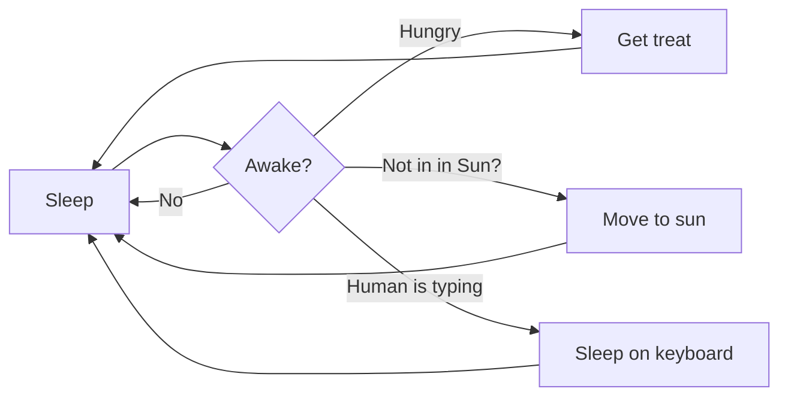

# Visual Studio Code 1.121

# Visual Studio Code 1.121

[LinkedIn](https://www.linkedin.com/showcase/vs-code)、[X](https://go.microsoft.com/fwlink/?LinkID=533687)、[Bluesky](https://bsky.app/profile/vscode.dev)でフォローしてください

* * *

_リリース日: 2026年5月20日_

ダウンロード：Windows：[x64](https://update.code.visualstudio.com/1.121.0/win32-x64-user/stable) [Arm64](https://update.code.visualstudio.com/1.121.0/win32-arm64-user/stable) | Mac: [ユニバーサル](https://update.code.visualstudio.com/1.121.0/darwin-universal-dmg/stable) [Intel](https://update.code.visualstudio.com/1.121.0/darwin-x64-dmg/stable) [silicon](https://update.code.visualstudio.com/1.121.0/darwin-arm64-dmg/stable) | Linux: [deb](https://update.code.visualstudio.com/1.121.0/linux-deb-x64/stable) [rpm](https://update.code.visualstudio.com/1.121.0/linux-rpm-x64/stable) [tarball](https://update.code.visualstudio.com/1.121.0/linux-x64/stable) [Arm](https://code.visualstudio.com/docs/supporting/faq#_previous-release-versions) [snap](https://update.code.visualstudio.com/1.121.0/linux-snap-x64/stable)

* * *

Visual Studio Code バージョン 1.121 のリリースへようこそ。今回のリリースでは、Mermaid および HTML のプレビュー機能が組み込まれ、エージェント向けのターミナルツールの動作が最適化され、リモートマシン上でエージェントセッションを実行できるようになりました。

-   [リモートエージェント](#_remote-agents-preview): 「エージェント」ウィンドウから、リモートマシン上のエージェントセッションを監視および制御できます。
    
-   [モデルの設定機能](#_language-models): コミットメッセージやタイトルなどの生成といった軽量なタスクを処理するモデルを設定できます。
 
-   [Mermaid 図のプレビュー](#_mermaid-diagrams-in-markdown-preview-and-notebooks): Markdown プレビューやノートブック内で Mermaid 図を直接レンダリングできます。
    
-   [HTMLファイルのプレビュー](#_quickly-open-html-files-in-the-integrated-browser): 拡張機能をインストールせずに、統合ブラウザでローカルのHTMLファイルをプレビューできます。
    
-   [ターミナルツールの最適化](#_terminal): 出力の圧縮強化とバックグラウンドでのターミナルクリーンアップにより、リソースとトークンの消費を削減します。
 

プログラミングを楽しんでください！

* * *

## エージェント

### エージェントウィンドウ (プレビュー)

前回のリリースで VS Code Stable にプレビューとして導入された、エージェント駆動型のコンパニオンウィンドウである「エージェントウィンドウ」の改善を継続しています。

エージェントウィンドウは、VS Codeのタイトルバーにある**「エージェントで開く」**ボタンを含む、いくつかの方法で開くことができます。その仕組みや機能の詳細については、[エージェントウィンドウのドキュメント](https://aka.ms/VSCode/Agents/docs)をご覧ください。

皆様からのフィードバックは、エージェントの機能改善に大いに役立っています。 すでに利用してフィードバックをいただいている皆様、ありがとうございます！引き続き[GitHubでイシューを登録](https://github.com/microsoft/vscode/issues)するか、[既存のイシュー](https://github.com/microsoft/vscode/issues?q=state%3Aopen%20label%3A%22agents-window%22)をご覧ください。

また、Agentsウィンドウにおける拡張機能の全体像についても引き続き検討を進めています。これには、拡張機能の有効化によってどのような機能が利用可能になるか、またこの環境下で各拡張機能がどのように動作すべきかといった点も含まれます。プロジェクトをまたいでエージェントを実行する新しいシナリオについてアイデアを共有したい場合でも、既存の拡張機能がAgentsウィンドウでどのように動作するかについてフィードバックを共有したい場合でも、[GitHubのイシュー](https://github.com/microsoft/vscode/issues?q=state%3Aopen%20label%3A%22agents-window%22)を通じて皆様と協力できれば幸いです。(https://github.com/microsoft/vscode/issues?q=state%3Aopen%20label%3A%22agents-window%22)を通じて、皆様と協力させていただきたいと考えています。

### リモートエージェント（プレビュー）

「エージェント」ウィンドウでは、SSH や開発用トンネルを介して接続可能な、ご自身が所有するリモートマシン上でエージェントセッションを実行する機能を実験的にサポートしています。ドキュメントの [リモートエージェントセッション](https://code.visualstudio.com/docs/copilot/concepts/agents#_remote-agent-sessions) について詳しくご覧ください。


#### リモートへの接続

「Agents」ウィンドウからリモートマシンに接続するには、次の2つの方法があります：

-   **SSH**：既存の `~/.ssh/config` エントリから選択するか、`user@host` を入力します。
-   **Dev Tunnels**：ターゲットマシンで `code tunnel` を実行して作成済みのトンネルから選択します。

#### 仕組み

この機能は、VS Codeのリモート開発拡張機能と似ていますが、同じものではありません。Agentsウィンドウはリモートに接続し、VS Code CLI (SSH) をダウンロードしてインストールするか、起動した開発用トンネルを介して実行中のCLIサーバーに接続します。これにより、「agent host」と呼ばれる軽量プロセスが開始され、 [Copilot SDK](https://www.npmjs.com/package/@github/copilot-sdk)

重要な点として、リモートエージェントホストは長期間実行されるプロセスです。クライアントが切断されても、実行中のセッションはリモート側で継続して実行されるため、リモートエージェントが動作し続けている間はノートパソコンを閉じても問題ありません。

#### エージェントホストプロトコル

「エージェント」ウィンドウとエージェントホスト間の接続には、**[エージェントホストプロトコル (AHP)](https://microsoft.github.io/agent-host-protocol/)**と呼ばれる新しいオープンプロトコルが使用されています。これは独立した仕様としてオープンに開発されています。

AHPの主要な設計原則は、複数のクライアントにわたるエージェントセッションの同時調整を可能にすることです。これが、ACPなどの他のプロトコルとの違いです。エージェントホストは権威ある状態を管理し、それを接続されたすべてのクライアントに同期させ、純粋なリデューサーを通じてすべての変更をシーケンス化します。

AHPはオープンプロトコルであるため、誰でもVS Code CLIのエージェントホストに接続するクライアントを構築したり、VS Codeが接続できるAHPエージェントホストを構築したりすることができます。

### OpenTelemetry と Grafana によるエージェントの可観測性

Azure Managed Grafanaチームとの協力により、VS Code内のエージェントが発信するOpenTelemetryシグナル用の、あらかじめ構築されたAzure Managed Grafanaダッシュボードが利用可能になりました。VS CodeをAzure Application Insightsに転送するOTelコレクターに接続し、Azure Managed Grafanaダッシュボードをインポートすることで、エージェントの操作、トークンの使用状況、チャットセッション、ツール呼び出し、およびモデルごとの応答時間や初回トークン取得時間（TTFT）を可視化できます。

エンドツーエンドの設定については [Grafana を使用した AI コーディング エージェントの監視](https://learn.microsoft.com/azure/managed-grafana/grafana-opentelemetry-app-insights#github-copilot) を、VS Code からのエクスポートを有効にする方法については [OpenTelemetry を使用したエージェント使用状況の監視](https://code.visualstudio.com/docs/copilot/guides/monitoring-agents) を参照してください。


### Claudeエージェントの自動許可モード（プレビュー）

**設定**: github.copilot.chat.claudeAgent.allowAutoPermissions VS Codeで開く VS Code Insidersで開く

Claudeエージェントは、許可プロンプトなしでClaudeを実行できる[自動モード](https://code.claude.com/docs/en/permission-modes#eliminate-prompts-with-auto-mode)に対応しました。別の分類器リクエストがアクションの実行前に審査を行い、リクエストの範囲を超えるもの、認識できないインフラストラクチャをターゲットとするもの、またはClaudeが読み取った悪意のあるコンテンツによって駆動されていると思われるものをブロックします。 これは、バックグラウンドでの安全チェックを維持しつつ、プロンプト入力による負担を軽減したい長時間のタスクに役立ちます。


権限モードピッカーに「Auto」オプションを表示するには、github.copilot を有効にしてください。github.copilot.claudeAgent.allowAutoPermissions VS Codeで開く VS Code Insidersで開く

> **注**: 安全チェックを一切行わない完全な無人実行（「YOLOモード」）を希望する場合は、github.copilot.claudeAgent.allowDangerouslySkipPermissions VS Codeで開く VS Code Insidersで開く を有効にして、「すべての権限をバイパス」が表示されるようにしてください。

## 言語モデル

このリリースでは、VS Code での言語モデルの設定および管理方法にいくつかの改善が加えられ、VS Code 内のさまざまなタスクにどのモデルを使用するかをより細かく制御できるようになりました。ドキュメントの [言語モデル](https://code.visualstudio.com/docs/copilot/customization/language-models) について詳しくご覧ください。

### ユーティリティモデルの設定

**設定**: chat.utilityModel VS Code で開く VS Code Insiders で開く、chat.utilitySmallModel VS Code で開く VS Code Insiders で開く

VS Code では、タイトル、要約、コミットメッセージの生成、リネームの提案、プロンプトの分類、意図の検出など、チャット関連のタスクをバックグラウンドで処理するためにユーティリティモデルを使用しています。デフォルトでは、これらのタスクには GitHub Copilot が提供するユーティリティモデルが使用されます。

以下のフローでは、Bring Your Own Key (BYOK) モデルを含む、利用可能な独自のモデルを使用できます:

-   chat.utilityModel VS Code で開く VS Code Insiders で開く : 一般的なユーティリティ フローで使用されるモデルを上書きします。
-   chat.utilitySmallModel VS Code で開く VS Code Insiders で開く : 高速で軽量なユーティリティ フローで使用されるモデルを上書きします。この設定には、高速かつリソース消費の少ないモデルを推奨します。

どちらの設定も、特に設定されていない場合は **Default** が使用され、GitHub Copilot が提供するユーティリティ モデルが維持されます。

### BYOK用カスタムエンドポイントプロバイダー（Insiders）

新たに「カスタムエンドポイントプロバイダー」というBYOKプロバイダーを提供開始しました。これにより、単一の設定から、Chat Completions、Responses、またはMessagesと互換性のある任意のエンドポイントをCopilot Chatに接続できるようになります。これは、Chat Completionsのみをサポートし、現在は非推奨となっている従来のOpenAI互換（`customoai`）プロバイダーに代わるものです。


このプロバイダーからモデルを追加する際、そのモデルが属するAPIファミリー（`chat-completions`、`responses`、または`messages`）を選択できます。


> **注**: カスタムエンドポイントプロバイダーは現在プレビュー段階であり、VS Code Insiders でのみ利用可能です。

## 統合ブラウザ

### 統合ブラウザで HTML ファイルをすばやく開く

以前は、HTML ファイルをプレビューするには拡張機能のインストールが必要でしたが、これは非常に一般的な操作であるにもかかわらず、不必要な手間となっていました。現在では、ファイル エクスプローラーでファイルを右クリックするか、ファイルが開いている状態でエディター タブを右クリックして、**統合ブラウザで開く** オプションを選択することで、ローカルの HTML ファイルを簡単に開くことができます。また、HTML ファイルがアクティブな状態で、エディターのタイトルバーにある **プレビュー** アイコンを選択することもできます。


### チャットへの要素追加機能の改善

より豊富な機能とテーマ対応を実現するため、要素選択のUIを一新しました。

#### 要素の範囲選択

クリックしてドラッグすることで要素の範囲を選択できるようになり、共有コンテナ内の要素を簡単に指定できるようになりました。

#### コンテキストメニューからの要素の添付

ページ内の任意の場所を右クリックすることで、要素をチャットにすばやく添付できるようになりました。


## ターミナル

### エージェントを認識するターミナルコマンド

コマンドラインツールでは、ターミナルコマンドが人間によって実行されたものか、VS Codeのエージェントフローによって実行されたものかを判別する手段がありませんでした。そのため、進行状況のアニメーション、 対話型プロンプト、詳細なフォーマット表示などが、エージェントセッションをブロックしたり混乱させたりする原因となっていました。

VS Codeでは、エージェントによって開始されたターミナルコマンドに対して、`VSCODE_AGENT`環境変数を設定するようになりました。CLIツールはこの変数をチェックすることで、機械可読な出力に切り替えたり、進行状況のアニメーションを抑制したり、セッションをブロックしてしまうようなプロンプトをスキップしたりできます。

CI やその他のエージェント向けに動作を調整しているスクリプトや CLI を管理している場合は、Copilot Chat から起動されるコマンドに対しても同様のパターンを適用できます。

### ターミナルツールのバックグラウンド実行インジケーター

以前は、ツール呼び出しが返った後もチャットターミナルコマンドが実行され続けている場合、チャット UI ではコマンドがすでに完了したように表示され、処理がまだ進行中であることが判別しにくくなっていました。

ツール呼び出しでは、ターミナルがアクティブな間、**「バックグラウンドで `<command>` を実行中 - 表示」** と表示されるようになりました。**「表示」** アクションを使用すると、その背後にあるターミナルを表示してフォーカスを合わせることができます。コマンドが完了すると、ヘッダーは通常の完了状態に戻ります。

これにより、特に非同期実行やタイムアウト後にバックグラウンド実行に移行したコマンドにおいて、コマンドがバックグラウンドでまだ実行中であることがより明確になります。

### バックグラウンドエージェントターミナルのクリーンアップ

以前は、複数のターミナルコマンドを含む長時間実行されるチャットセッションがある場合、各コマンドの終了後にバックグラウンドターミナルが蓄積され、ターミナルリストが古いエントリで埋まり、リソースを消費する原因となっていました。

VS Code では、チャットエージェントによって作成されたバックグラウンドターミナルについて、コマンドが完了すると自動的に破棄されるようになりました。ただし、チャット UI にはコマンドの出力が引き続き保持されます。**Show** を使用してバックグラウンドターミナルを表示すると、そのターミナルは開いたままになり、引き続き内容を確認したり操作したりすることができます。

これにより、ターミナルリストが整理され、複数ターンにわたるセッションでのリソース使用量が削減されます。

### ターミナルツール出力の圧縮範囲の拡大

**設定**: chat.tools.compressOutput.enabled VS Codeで開く VS Code Insidersで開く

`pytest`、`jest`、`cargo test`、`tsc` などのコマンドやパッケージインストールワークフローでは、重要な結果が表示される前に大量の進行状況出力が生成されることが多く、 これによりトークンが無駄になり、モデルが関連情報を見つけにくくなっていました。

Chatのターミナルツールは、モデルに送信する前に、より多くの種類の詳細なコマンド出力を圧縮するようになりました。対象範囲の拡大には、一般的なテストランナー、ビルドツール、リンター、Dockerコマンド、パッケージマネージャーが含まれており、繰り返される進行状況情報やその他の価値の低い出力がより頻繁に削除されます。

これにより、モデルが長いターミナル実行を解釈しやすくなり、定型的な出力にトークンを消費する可能性が低くなります。

### 機密性の高いターミナルプロンプトはターミナル内に留まる

ターミナルコマンドにおけるパスワード、パスフレーズ、PIN、または認証コードのプロンプトはリスクを伴う可能性があります。エージェントがこれらのプロンプトを自ら処理しようとすると、誤って機密情報を取得したり、再生したりする恐れがあるからです。

チャット経由のターミナルコマンドが機密性の高いプロンプトに到達した場合、VS Code がそれをインターセプトするようになりました。デフォルトの権限モードでは、チャットに確認ダイアログが表示され、ターミナルにフォーカスを移して機密情報を直接入力できるようになります。自動承認フローでは、VS Code がコマンドをキャンセルし、モデルに対して再試行や機密情報の要求を行わないよう指示します。

これにより、認証情報がチャットのコンテキストに混入するのを防ぎ、エージェントが誤って機密入力を公開したり再生したりするのを防止します。

## エディター

### クイック提案のデフォルト設定変更

Copilotのインライン提案は、常に提案コントロールの選択範囲と一致します。これは非常に便利で、Tabキーを2回押すだけで、Copilotからの提案とゴーストテキストの両方を素早く受け入れることができます。

しかし、入力を開始すると、多くの場合、提案コントロールがポップアップし、入力した文字で始まる利用可能なグローバルシンボルの中で（アルファベット順で）最も先頭にあるものが選択されてしまうことが判明しました。 これは実際にタイプしたいテキストであることはめったになく、また、Copilotがその誤った接頭辞を含む提案を表示することになり、操作体験が煩雑になってしまいます。

そこで、クイック提案のデフォルト設定を変更することにしました（ editor.quickSuggestions VS Codeで開く VS Code Insidersで開く ）。インライン補完プロバイダー（Copilotなど）が利用可能な場合、エディターで文字を入力しても、提案コントロールが自動的に表示されなくなります。 それ以外の場合は、従来通り提案コントロールが表示されます。以下の設定を行うことで、以前の動作に戻すことができます：

```
"editor.quickSuggestions": {
  "other": "on",
  "comments": "off",
  "strings": "off"
}
```

## 言語

### Markdown プレビューおよび Notebooks での Mermaid ダイアグラム

Matt Bierner 氏の [Markdown プレビューにおける Mermaid サポート](https://marketplace.visualstudio.com/items?itemName=bierner.markdown-mermaid) を、`Mermaid Markdown Features` という新しい組み込み拡張機能として VS Code に統合しました。この拡張機能により、VS Code の組み込み Markdown プレビュー、ノートブックの Markdown セル、およびチャットに [Mermaid ダイアグラム](https://mermaid.js.org) のレンダリング機能が追加されます。

Mermaid図は、Markdown内の`mermaid` [フェンス付きコードブロック](https://docs.github.com/en/get-started/writing-on-github/working-with-advanced-formatting/creating-and-highlighting-code-blocks#fenced-code-blocks)を使用して作成できます：

````

````

Markdownプレビューでの図は次のようになります：


レンダリングされたMermaid図はパンやズームにも対応しており、プレビュー画面を離れることなく大きな図を簡単に確認できます。また、図を右クリックしてMermaidソースをコピーすることも可能です。

### Markdownプレビュー内のYAMLフロントマター

**設定**: markdown.preview.frontMatter VS Codeで開く VS Code Insidersで開く

Markdown プレビューでの [YAML フロントマター](https://docs.github.com/en/contributing/writing-for-github-docs/using-yaml-frontmatter) のレンダリング方法を制御するオプションを追加しました。デフォルトでは、VS Code はプレアambleを非表示にする代わりに、フロントマターをプレビューの上部に表として表示します。


`markdown.preview.frontMatter` 設定（VS Code で開く / VS Code Insiders で開く）を使用して、フロントマターの表示方法を選択できます:

-   `table` (デフォルト): フロントマターをテーブルとしてレンダリングします。
-   `codeBlock`: フロントマターを YAML コードブロックとしてレンダリングします。
-   `hide`: プレビューからフロントマターを非表示にします。

レンダリングされたフロントマターには、プレビューからこの設定をすばやく開くためのコンテキストメニュー項目も用意されています。

## 非推奨の機能と設定

### このリリースでの新たな非推奨項目

### 今後非推奨となる機能

## 感謝

課題追跡への貢献者：

-   [@gjsjohnmurray (John Murray)](https://github.com/gjsjohnmurray)
-   [@RedCMD (RedCMD)](https://github.com/RedCMD)
-   [@IllusionMH (Andrii Dieiev)](https://github.com/IllusionMH)
-   [@albertosantini (Alberto Santini)](https://github.com/albertosantini)

`vscode`への貢献:

-   [@ba-work (Brock Alberry)](https://github.com/ba-work): outputMonitor: エージェントループを一時停止させていた2つの誤検知ファミリーを修正 [PR #315485](https://github.com/microsoft/vscode/pull/315485)
-   [@guomaggie](https://github.com/guomaggie): スニペットのハイドレーションエラー時に最終回答テキストを返す [PR #316094](https://github.com/microsoft/vscode/pull/316094)
-   [@kevin-m-kent](https://github.com/kevin-m-kent): 繰り返しポーリングにおけるターミナル出力の差分処理の実験 [PR #315543](https://github.com/microsoft/vscode/pull/315543)
-   [@NikolaRHristov (Nikola Hristov)](https://github.com/NikolaRHristov): 修正: テストヘルパー内の relayCreationTimeoutMs に対する protected 修飾子の復元 [PR #316049](https://github.com/microsoft/vscode/pull/316049)
-   [@SebTardif (Sebastien Tardif)](https://github.com/SebTardif): リスナーのリークを修正：onDidProgressStep コールバックから onDidChangeConfiguration を移動 [PR #314636](https://github.com/microsoft/vscode/pull/314636)
-   [@SimonSiefke (Simon Siefke)](https://github.com/SimonSiefke): 修正: lifeCycleMainService におけるメモリリーク [PR #315891](https://github.com/microsoft/vscode/pull/315891)
-   [@thernstig (Tobias Hernstig)](https://github.com/thernstig): 修正: typescript.tsdk.desc を新しい js/ts.tsdk.path に置き換え [PR #315268](https://github.com/microsoft/vscode/pull/315268)
-   [@thirteenflt (yutingsun)](https://github.com/thirteenflt): vsc promptD の変更 [PR #316733](https://github.com/microsoft/vscode/pull/316733)
-   [@yavanosta (Dmitry Guketlev)](https://github.com/yavanosta): InlineCompletionsModel 内の appearedInsideViewport をリアクティブにする (#\_289944) [PR #289946](https://github.com/microsoft/vscode/pull/289946)

## 感謝

課題追跡への貢献:

-   [@gjsjohnmurray (John Murray)](https://github.com/gjsjohnmurray)
-   [@RedCMD (RedCMD)](https://github.com/RedCMD)
-   [@IllusionMH (Andrii Dieiev)](https://github.com/IllusionMH)
-   [@albertosantini (Alberto Santini)](https://github.com/albertosantini)

`vscode`への貢献：

-   [@ba-work (Brock Alberry)](https://github.com/ba-work): outputMonitor: エージェントループを一時停止させる2つの誤検知ファミリーを修正 [PR #315485](https://github.com/microsoft/vscode/pull/315485)
-   [@guomaggie](https://github.com/guomaggie): スニペットのハイドレーションエラー時に最終回答テキストを返す [PR #316094](https://github.com/microsoft/vscode/pull/316094)
-   [@kevin-m-kent](https://github.com/kevin-m-kent): 繰り返しポーリングにおけるターミナル出力の差分に関する実験 [PR #315543](https://github.com/microsoft/vscode/pull/315543)
-   [@NikolaRHristov (Nikola Hristov)](https://github.com/NikolaRHristov): 修正: テストヘルパー内の relayCreationTimeoutMs に対する protected 修飾子の復元 [PR #316049](https://github.com/microsoft/vscode/pull/316049)
-   [@SebTardif (Sebastien Tardif)](https://github.com/SebTardif): リスナーのリークを修正: onDidProgressStep コールバックから onDidChangeConfiguration を移動 [PR #314636](https://github.com/microsoft/vscode/pull/314636)
-   [@SimonSiefke (Simon Siefke)](https://github.com/SimonSiefke): 修正: lifeCycleMainService のメモリリーク [PR #315891](https://github.com/microsoft/vscode/pull/315891)
-   [@thernstig (Tobias Hernstig)](https://github.com/thernstig): 修正: typescript.tsdk.desc を新しい js/ts.tsdk.path に置き換え [PR #315268](https://github.com/microsoft/vscode/pull/315268)
-   [@thirteenflt (yutingsun)](https://github.com/thirteenflt): vscのpromptDを変更 [PR #316733](https://github.com/microsoft/vscode/pull/316733)
-   [@yavanosta (Dmitry Guketlev)](https://github.com/yavanosta): InlineCompletionsModel の appearedInsideViewport をリアクティブにする (#\_289944) [PR #289946](https://github.com/microsoft/vscode/pull/289946)

* * *

新機能が利用可能になり次第、ぜひお試しいただければ幸いです。最新情報を確認するため、定期的にこちらをチェックしてください。

> 過去の VS Code バージョンのリリースノートをご覧になりたい場合は、[code.visualstudio.com](https://code.visualstudio.com) の [Updates](https://code.visualstudio.com/updates) をご覧ください。

[](# "ページトップへ")
